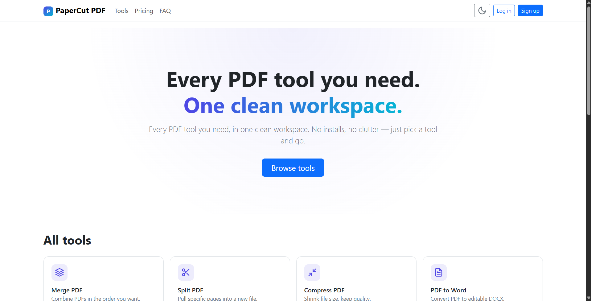
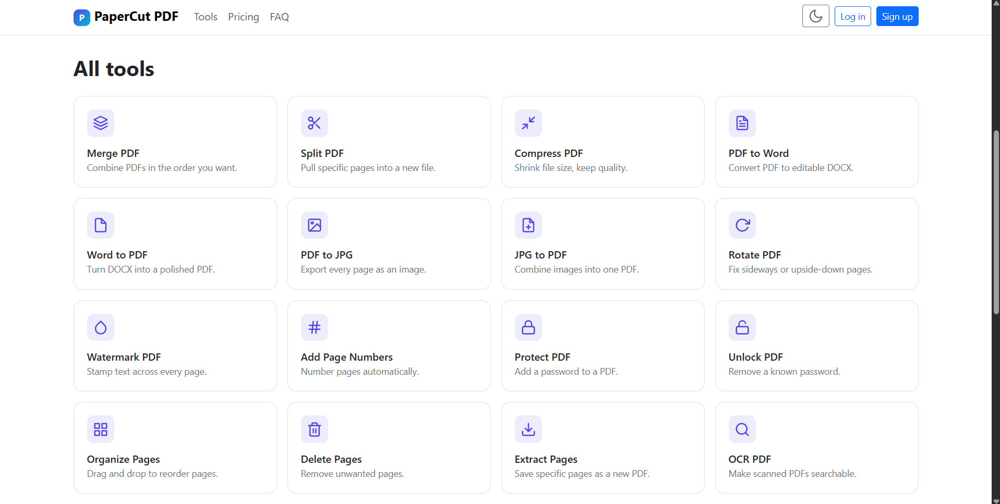
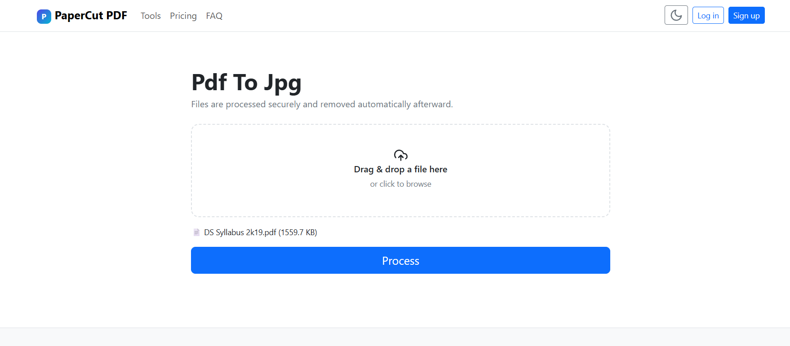
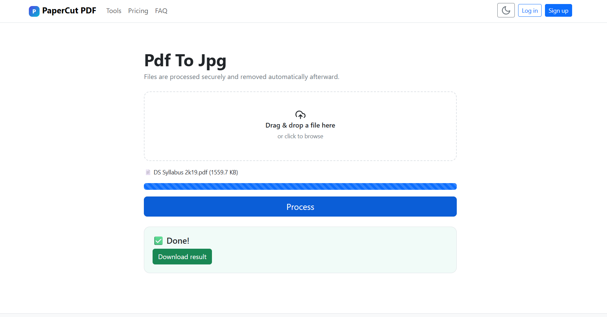

# PaperCut PDF Toolkit

PaperCut PDF Toolkit is a Flask web application for performing common PDF and image operations with a simple and user-friendly interface.

## Features

- Merge PDFs
- Split PDFs
- Compress PDFs
- Rotate PDFs
- Add Watermarks
- Add Page Numbers
- Protect & Unlock PDFs
- Organize, Delete & Extract Pages
- PDF ↔ JPG
- PDF ↔ Word
- OCR Support
- User Login & Admin Panel

## Screenshots

### Home Page

### Tools Page

### PDF to JPG

### Processing

## Tech Stack

- Python
- Flask
- SQLite
- Bootstrap 5
- PyMuPDF
- Pillow
- Tesseract OCR
